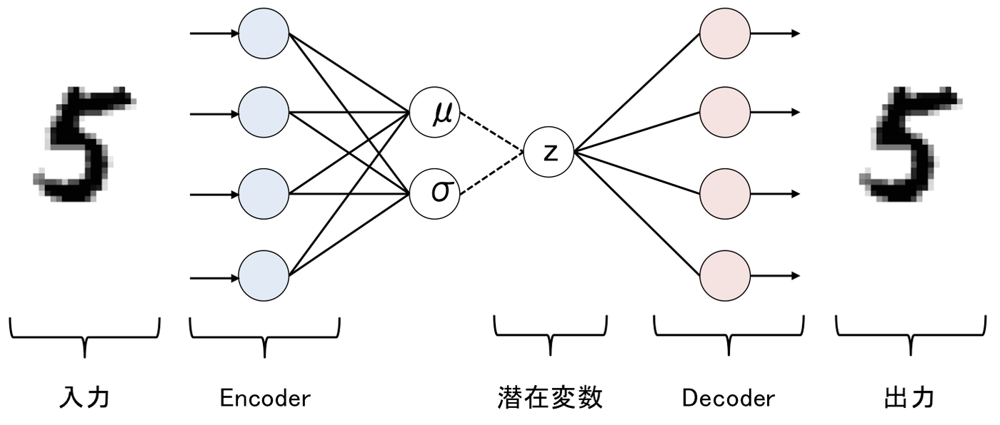

## VAEs (Variational AutoEncoder)

### Introduction
In the last few years, deep learning based generative models have gained more and more interest due to (and implying) some amazing improvements in the field.  

Relying on huge amount of data, well-designed networks architectures and smart training techniques, deep generative models have shown an incredible ability to produce highly realistic pieces of content of various kind, such as images, texts and sounds.   

Among these deep generative models, two major families stand out and deserve a special attention: Generative Adversarial Networks (GANs) and Variational Autoencoders (VAEs).   

In a nutshell, a VAE is an autoencoder whose encodings distribution is regularised during the training in order to ensure that its latent space has good properties allowing us to generate some new data.   

Moreover, the term “variational” comes from the close relation there is between the regularisation and the variational inference method in statistics.


### The Architecture of AE(autoencoder)
<center>


</center>     

### The Architecture of VAEs
<center>   
      

Images are taken from [source](https://qiita.com/kenchin110100/items/7ceb5b8e8b21c551d69a)
</center>


### Training on MNIST
<p></p>
<center>

</center>

### Requirement
```
python==3.7.0
numpy==1.18.1
```
### How to use
Training & Prediction can be run as follows:    
`python train.py train`  
`python train.py predict img.png`  


### More information
* Please refer to the original paper of VAE [here](https://towardsdatascience.com/understanding-variational-autoencoders-vaes-f70510919f73) for more information.

### Parameters for training:   
* Learning rate = 1e-4
* Batch size = 4  
* Optimizer = Adam   
* latent_dim = 200
